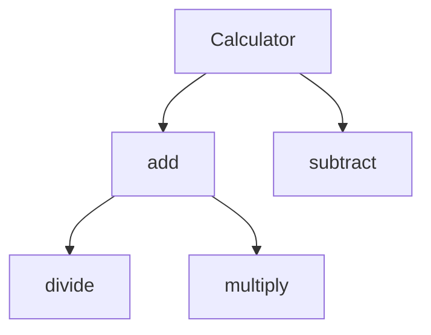

# v0.2.0 Improvements — Language & Features

**Focus:** Expand language coverage, export formats, and entry point detection.

---

## 5. Add More Language Extractors

Currently supports: Python, Rust, TypeScript, JavaScript, Go, C. For v0.2.0, add:

| Language | Regex Pattern Notes |
|----------|-------------------|
| **Dart** | Functions, classes, mixins — `(?:\\w+\\s+)?(?:Future<\\w+>\\s+)?(\\w+)\\(` |
| **Kotlin** | `fun`, `class`, `object`, `data class` — `fun\\s+(\\w+)\\(` |
| **Swift** | `func`, `class`, `struct` — `func\\s+(\\w+)\\(` |
| **Ruby** | `def`, `class`, `module` — `def\\s+(\\w+)` |
| **PHP** | `function`, `class`, `interface` — `function\\s+(\\w+)\\(` |
| **Scala** | `def`, `class`, `object` — `def\\s+(\\w+)\\(` |

Each new extractor should be a method following the existing pattern:
```python
def _extract_dart(self, f: Path, content: str):
    """Extract Dart functions and classes."""
    ...
```

---

## 6. Support Multiple Output Formats

Currently, tiles are only submitted to PLATO. Add export options:

- **JSON manifest** (`--format json`) — Save twin as a JSON file with all tiles
- **YAML manifest** (`--format yaml`) — YAML output for human readability
- **Markdown report** (`--format md`) — Readable markdown summary of extracted modules

```bash
python -m plato_twin_maker --repo ./my-project --format json --output twin.json
```

This enables twin creation without requiring PLATO to be running (currently cached tiles are lost after process exit).

---

## 7. Tune Entry Point Scanning

The current entry point scan uses a fixed list of filenames. For v0.2.0, add language-specific heuristics:

- **Python**: Check `setup.py` / `pyproject.toml` for `entry_points` or `scripts`
- **Node.js**: Parse `package.json` `"main"`, `"bin"`, and `"exports"` fields
- **Rust**: Parse `Cargo.toml` `[[bin]]` sections
- **Go**: Check `go.mod` module path + `main()` presence
- **C/C++**: Scan for `int main(` or `int main(` across files

```python
def _find_entry_points(self) -> list[str]:
    """Find main files with language-specific heuristics."""
    candidates = super()._find_entry_points()
    
    if self._analysis.build_system in ('cargo', 'rust'):
        # Parse Cargo.toml for [[bin]] entries
        cargo_file = self.path / 'Cargo.toml'
        if cargo_file.exists():
            ...
    
    if self._analysis.build_system in ('npm', 'node'):
        # Parse package.json
        package_file = self.path / 'package.json'
        if package_file.exists():
            ...
    
    return candidates
```

---

## 8. Add Dependency Graph Export

From the extracted module dependencies, generate a Mermaid.js dependency graph:



This would be output as a separate file or embedded in the root tile's answer field:

```bash
python -m plato_twin_maker --repo ./my-project --deps-graph deps.md
```

This visualization is invaluable for repo onboarding and architecture review.
